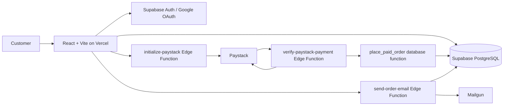

# Architecture

The storefront uses React, Supabase Auth and PostgreSQL. Paystack handles hosted checkout; Edge Functions initialize and verify payments with a server-only secret. PostgreSQL creates paid orders transactionally, another Edge Function sends receipts through Mailgun, and Vercel hosts the frontend.

## System Context

The browser uses only the Supabase publishable/anon key and the signed-in user's session. RLS protects data exposed through the client API. Service-role and Mailgun credentials remain server-side.

## Order Flow

1. A guest cart is stored locally. After authentication, items merge into the persisted cart and are revalidated; later changes use `save_cart`.
2. The customer submits delivery details. The storefront waits for cart synchronization and calls `initialize-paystack` with the visible item IDs, quantities, and displayed total.
3. A service-role database function atomically reconciles those lines with current catalog prices and stock, replaces any stale saved-cart rows, verifies the displayed total, and creates a payment attempt. The Edge Function sends the resulting server-calculated amount in kobo to Paystack; the shop bears gateway fees.
4. On return, `verify-paystack-payment` verifies status, amount, currency, reference and customer with Paystack.
5. `place_paid_order` creates the paid order, preserves item price snapshots, decrements stock and clears the database cart in one transaction.
6. The storefront clears the local cart, sends the receipt, and displays “Order placed successfully.” Failed or cancelled payments leave the cart intact.
7. Email failures do not cancel the order. The owner-only `get_order_email_status` function supports status checks and retries after refresh.

## Trust Boundaries

- **Browser:** untrusted input and display only. Do not trust browser totals, user IDs, stock, or product prices.
- **Database:** source of truth for identity context, catalog prices, stock, cart, and orders. Enforce RLS and transactional order logic.
- **Edge Function:** server-side integration boundary for Mailgun. Verify authentication and order ownership; keep provider credentials in function secrets.
- **Paystack:** receives a server-computed amount and confirms payment. Never trust a browser callback as proof of payment; verify it from the Edge Function.
- **Vercel:** serves the frontend and its public configuration. Do not deploy server secrets as client-exposed `VITE_` variables.

## Failure Behavior

- A failed order transaction creates no partial order and does not clear the cart.
- An email provider failure is logged and can be retried without creating another order.
- A stale cart is revalidated against current product status, variants, prices, and stock before order placement.

Implementation details, function contracts, and schema changes should be reflected in migrations and the database documentation.